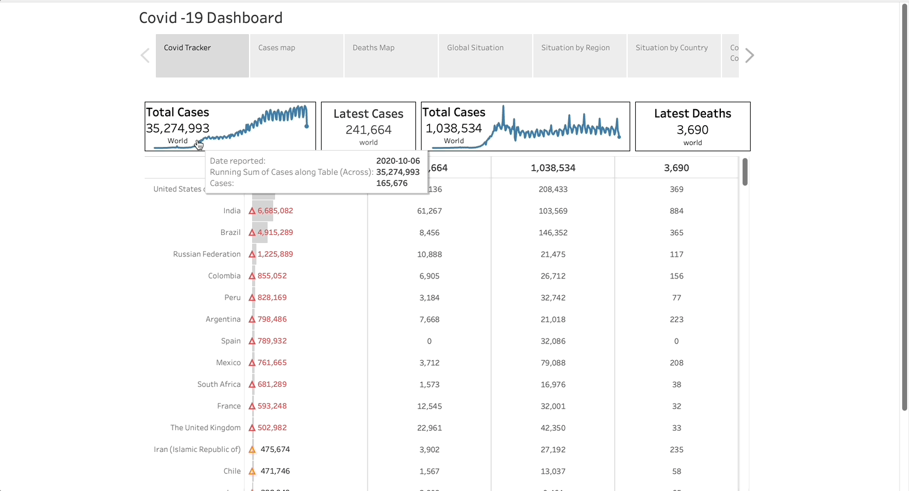
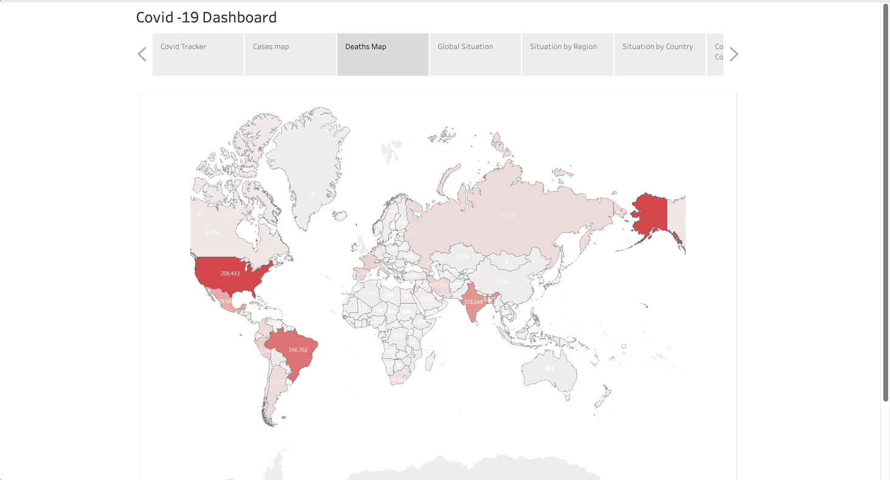
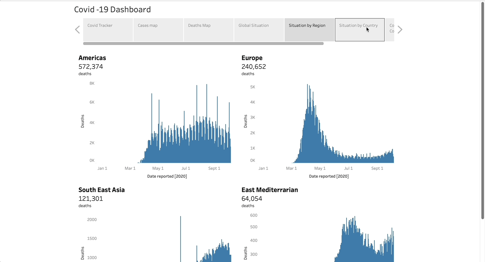

# COVID-19 Tracker

## Introduction

This repository hosts a COVID-19 Tracker designed to provide real-time updates and insights on the pandemic's status globally. It serves as an informative tool for users to visualize the spread, trends, and impact of COVID-19 through interactive data visualizations.

## GIF Visualizations

### COVID Tracker
  
*This GIF contains the tracker, case map, and death map.*

### Global Situation
  
*This GIF showcases the global situation of the pandemic.*

### Situation by Country
  
*This GIF depicts the situation by country, confirmed cases, and country comparisons.*

## About the Tracker

The tracker presents an array of statistics including case counts, recovery rates, mortality rates, and vaccination progress across different regions and countries.

## Key Features

- **Up-to-the-Minute Updates**: Offering the latest available data on the pandemic.
- **Worldwide and Local Data**: Global insights and the ability to zoom in on specific countries or regions.
- **Vaccination Tracking**: Current data on vaccination distribution and administration.
- **Detailed Interactivity**: Engaging visualizations that allow for user interaction to filter and explore the data.

## Insights

The COVID-19 Tracker has revealed several key insights:

- **Infection Trends**: Identifying peaks and declines in case numbers, which can be correlated with public health interventions.
- **Vaccination Efficacy**: Showcasing the impact of vaccination campaigns on case and mortality rates.
- **Regional Disparities**: Highlighting differences in pandemic response effectiveness across various regions.
- **Strain Variations**: Tracking the emergence of new virus strains and their spread.
- **Socioeconomic Impact**: Providing data on the indirect effects of the pandemic, such as economic downturns and healthcare system strain.

These insights can inform public health decisions and individual actions to navigate the pandemic more effectively.

## Tableau Visualization

Access the COVID-19 Tracker's interactive visualizations on Tableau Public:
[Covid-19 Analysis Visualization on Tableau Public](https://public.tableau.com/app/profile/sai.kiran7316/viz/Covid_analysis_venkata/Story1?publish=yes)

## Usage

Click the Tableau link to explore the tracker. The platform allows for a comprehensive and interactive experience. Users can select various views, apply filters, and hover over elements for more details.

## Data Sources

The tracker compiles data from trusted global sources, ensuring accuracy and reliability. These sources are updated regularly to reflect ongoing changes in the pandemic's trajectory.

## Contributing

Contributions to the COVID-19 Tracker are welcome. For feature suggestions or data additions, please reach out via the Tableau Public profile.

## Disclaimer

The COVID-19 Tracker is for informational purposes only. While we strive for accuracy, we do not warrant the completeness or current validity of the data presented.

